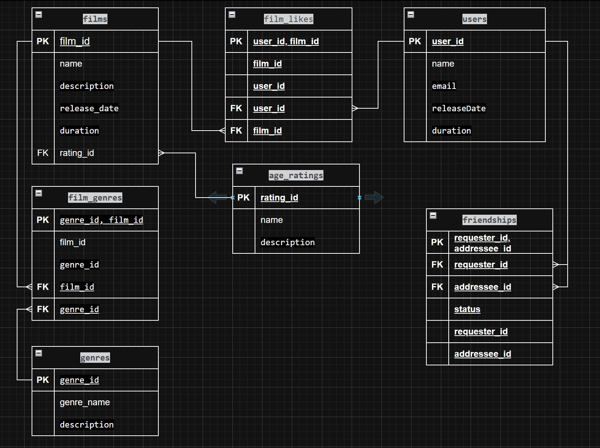

# Схема базы данных

## Основные таблицы

### `users`
Содержит данные о пользователях

### `films`
Содержит данные о фильмах

## Справочники

### `age_ratings`
Возрастные ограничения

### `genres`
Жанры фильмов

## Связующие таблицы

### `film_genres`
Связывает фильмы с жанрами

### `film_likes`
Лайки пользователей

### `friendships`
Дружеские связи между пользователями со статусом

-- создаем базу данных
CREATE DATABASE filmorate_repository;
-- подключились к ней через настройки
-- создаем схему фильмотеки
CREATE SCHEMA filmorate;

-- Добавляем таблицы
CREATE TABLE age_ratings (
    rating_id BIGINT PRIMARY KEY GENERATED ALWAYS AS IDENTITY,
    rating_name VARCHAR(50) NOT NULL UNIQUE,
    description VARCHAR(255)
);

CREATE TABLE films(
    film_id BIGINT PRIMARY KEY GENERATED ALWAYS AS IDENTITY,
    name VARCHAR(255) NOT NULL CHECK (name <> ''),
    description VARCHAR(200) NOT NULL,
    CHECK (LENGTH(TRIM(description)) >= 1),
    release_date DATE NOT NULL CHECK (release_date >= '1895-12-28'),
    duration INTEGER NOT NULL CHECK (duration > 0),
    rating_id BIGINT ,
    FOREIGN KEY (rating_id) REFERENCES age_ratings(rating_id)
);

CREATE TABLE genres (
    genre_id BIGINT PRIMARY KEY GENERATED ALWAYS AS IDENTITY,
    genre_name VARCHAR(100) NOT NULL UNIQUE,
    description TEXT
);

CREATE TABLE film_genres (
    film_id BIGINT,
    genre_id BIGINT,
    PRIMARY KEY (film_id, genre_id),
    FOREIGN KEY (film_id) REFERENCES films(film_id),
    FOREIGN KEY (genre_id) REFERENCES genres(genre_id)
);

CREATE TABLE users (
    user_id BIGINT PRIMARY KEY GENERATED ALWAYS AS IDENTITY,
    email  VARCHAR(255) NOT NULL,
    login VARCHAR(255) NOT NULL,
    name VARCHAR(255),
    birthday DATE NOT NULL,
    CHECK (birthday <= CURRENT_DATE)
);

CREATE TABLE film_likes (
    user_id BIGINT,
    film_id BIGINT,
    PRIMARY KEY (user_id, film_id),
    FOREIGN KEY (user_id) REFERENCES users(user_id),
    FOREIGN KEY (film_id) REFERENCES films(film_id)
);

CREATE TABLE friendships (
    requester_id BIGINT NOT NULL,
    addressee_id BIGINT NOT NULL,
    status VARCHAR(20) NOT NULL,
    PRIMARY KEY (requester_id, addressee_id),
    FOREIGN KEY (requester_id) REFERENCES users (user_id) ON DELETE CASCADE,
    FOREIGN KEY (addressee_id) REFERENCES users (user_id) ON DELETE CASCADE,
    CHECK (requester_id <> addressee_id),
    CHECK (status IN ('pending', 'confirmed'))
);

